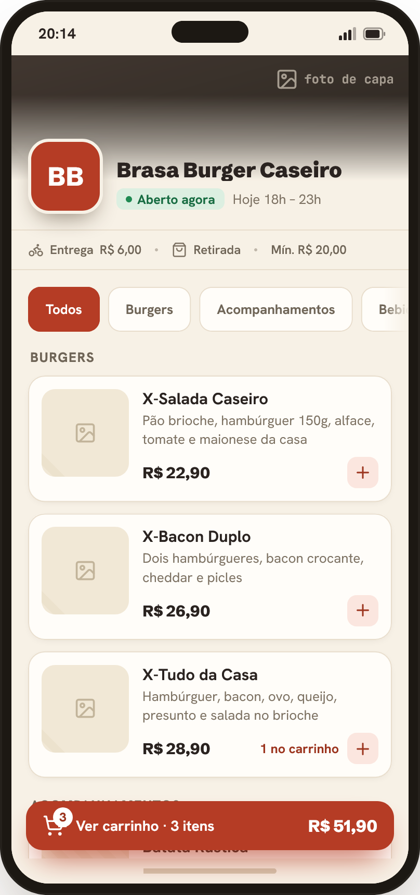

# Comanda

Comanda is a mobile-first, multi-tenant SaaS for small food businesses to publish a digital menu,
receive orders and operate their workflow without dedicated hardware. Each business has an
isolated storefront at `<tenant>.<APP_DOMAIN>` and an authenticated owner panel.



## Highlights

- Self-service signup and guided onboarding with a starter menu.
- Public menu, cart, checkout and persisted order handoff to WhatsApp.
- Owner dashboard with live polling, connectivity feedback and an auditable order state machine.
- Category, product, availability and additional-option management.
- Business settings for branding, WhatsApp, hours, fees, minimum order and subdomain.
- Free and Essential plan enforcement with manual MVP activation.
- Installable owner PWA with offline shell, update prompt and scoped Service Worker.
- Tenant isolation from the request boundary through persistence, covered by integration tests.

## Architecture

| Layer | Technology |
| --- | --- |
| Frontend | React 19, TypeScript, Vite 8, Tailwind CSS 4, TanStack Query |
| Backend | Java 21, Spring Boot 4.1, Spring Security, Spring Data JPA |
| Database | PostgreSQL 17, Flyway |
| Delivery | Executable Spring Boot JAR with the generated SPA embedded |
| Runtime | Docker / Docker Compose |

The Maven lifecycle installs the pinned Node and Yarn versions, builds the SPA into
`comanda-api/target/generated-resources/static`, copies it into the application classpath and
packages one executable JAR. Generated frontend output is not committed.

## Repository structure

```text
comanda-api/       Spring Boot API, domain logic, migrations and backend tests
comanda-client/    React application, public assets and frontend tests
docs/              Product requirements and operational/LGPD documentation
openspec/specs/    Consolidated executable product specifications
deploy/            Deployment, backup and rollback tooling
```

## Verify the project

Requirements for the integrated build are Java 21 and Docker. Maven downloads the pinned Node
22.22.x and Yarn 1.22.22 runtimes. Docker is used by Testcontainers for PostgreSQL integration
tests.

```bash
cd comanda-api
APP_DOMAIN=comanda.app \
VITE_TENANT_DOMAIN=comanda.app \
VITE_ROOT_HOST_ALIASES=preview.comanda.app \
./mvnw -B clean verify
```

This command runs the TypeScript/Vite production build, frontend tests, ESLint, backend tests,
Flyway migrations against PostgreSQL and executable JAR packaging.

To validate the consolidated specifications:

```bash
openspec validate --all --strict
```

## Run locally with Docker

Build the application image with a local domain:

```bash
docker build \
  --build-arg APP_DOMAIN=localhost \
  --build-arg VITE_TENANT_DOMAIN=localhost \
  --build-arg VITE_ROOT_HOST_ALIASES=127.0.0.1 \
  -t comanda-local .
```

Run PostgreSQL and the application on the same Docker network, providing the variables documented
in [`.env.example`](.env.example). The root application is available at
`http://localhost:8080`; a tenant such as `minha-loja` is available at
`http://minha-loja.localhost:8080`.

## Domain policy

`APP_DOMAIN` defines the root domain and `VITE_TENANT_DOMAIN` defines canonical tenant URLs.
`www`, `app`, `api`, `docs`, `status`, `admin`, `demo` and `signal` are permanently reserved.

## Quality baseline

The current pre-deployment baseline includes:

- 56 frontend tests.
- 101 backend tests.
- strict validation of 17 consolidated OpenSpec specifications.
- reproducible frontend embedding and host-configuration checks.
- multi-tenant, IDOR, rate-limiting, log-safety and checkout-idempotency coverage.

The development baseline is complete. VPS provisioning, production/demo isolation, DNS/TLS,
physical-device PWA testing, real WhatsApp testing and production operational validation remain
deployment activities.

## Product and operational documentation

- [Product requirements](docs/Comanda_PRD.md)
- [Incident response plan](docs/incident-response-plan.md)
- [PWA rollback procedure](docs/pwa-rollback.md)
- [Record of processing activities](docs/ropa.md)
